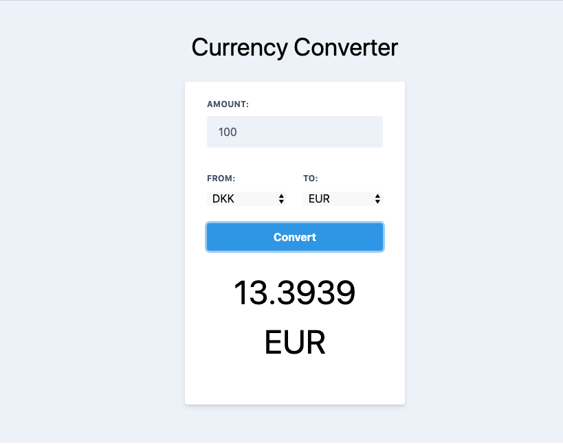

## Currency Converter 
Gives exchange rate for all the countries and the desired total amount. 

## Preview

## Built with 
- Create React App
- Tailwind css
- Deployed in netlify

## Installation
- npx i create-react-app
- npm install tailwindcss for more info [https://tailwindcss.com](https://tailwindcss.com/docs/installation/)
- npm start

## Online version
[Currency Converter](https://currency-converter-app.netlify.com/)

